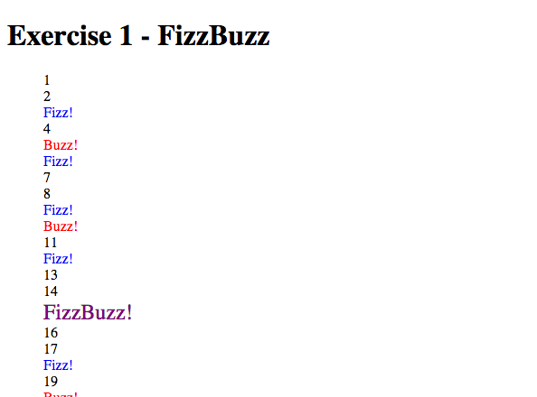
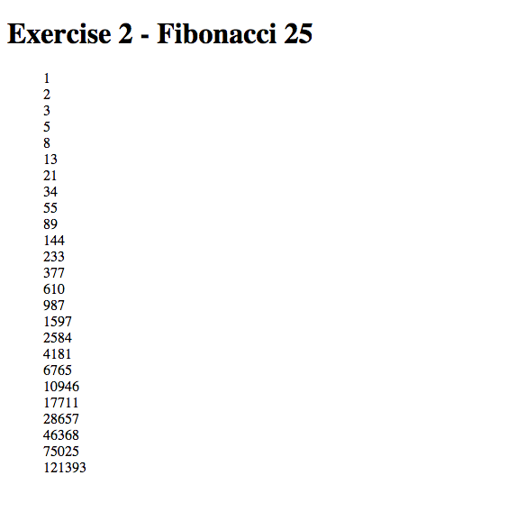
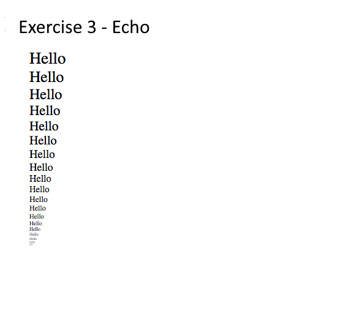

# MVC Views Part 1 Exercises

## 1. Fizzbuzz

Add a list item (i.e. `<li>`) containing each of the numbers from 1 to 100.
				
- if the number is divisible by 3, show "Fizz!" instead and style the item using the `fizz` class
				
- if the number is divisible by 5, show "Buzz!" instead and style the item using the `buzz` class
				
- if the number is divisible by both 3 and 5, show "FizzBuzz!" instead  and style the item using the `fizzbuzz` class

				
## 2. Fibonacci

Add a list item (i.e. `<li>`) for each of the first 25 numbers in the Fibonacci sequence

## 3. Echo

Given two query string parameters, `word` and `count`:
			
- Add a number of list items equal to `count`.  Each list item should contain the value passed in `word`.
			
- The font size of the first list item should be equal to `count`.  The font size of each subsequent list item should be decreased by 1.

