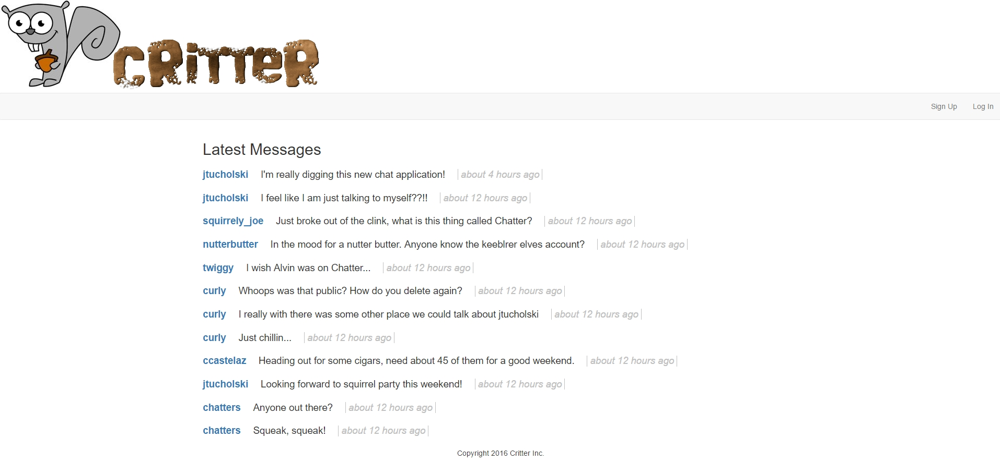

# Critter

Hello and welcome to Critter, the first real-time messaging platform. This application was created to provide a way to securely send
squeaks between two critters as well as public squeaks where you can voice your misinterpreted but well-intentioned thoughts.

## Setup

1. Create a new database called **CritterDB**

2. Run the critter.sql script against the database.

3. Make sure to update the `Initial Catalog` in your web.config file to refer to the database **CritterDB**

4. Try running!!

